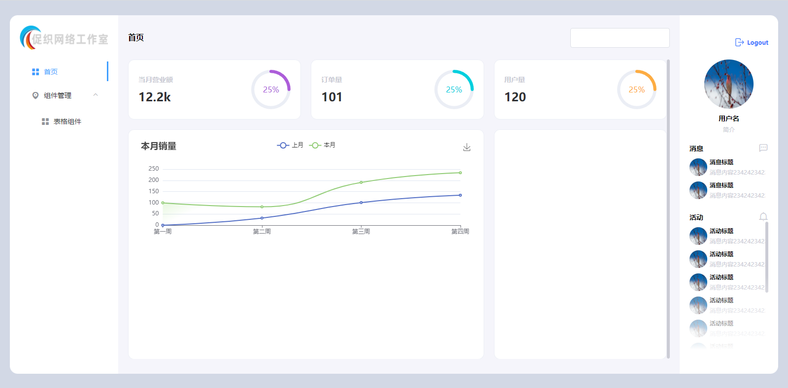
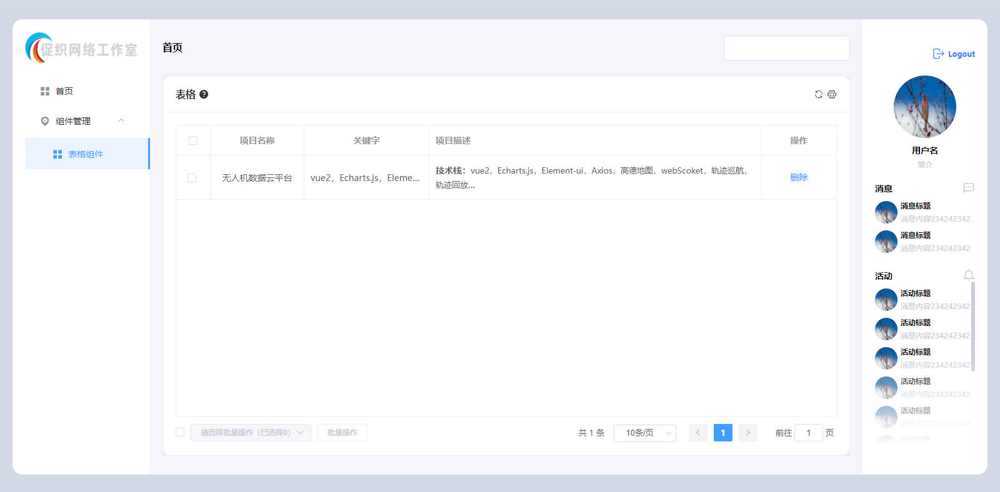

## 平台简介

由于平时工作中每次新建项目一些方法和组件都要重新迁移或者 cv 一遍比较费时费力，打算搭建一个基于 Vue2 相对完善的脚手架，目前正在根据自己平时工作中封装的组件或者方法慢慢集成到这里面来。后续也会上传 Node.js 项目

## 项目展示
<table>
    <tr>
        <td></td>
        <td></td>
    </tr>
</table>
